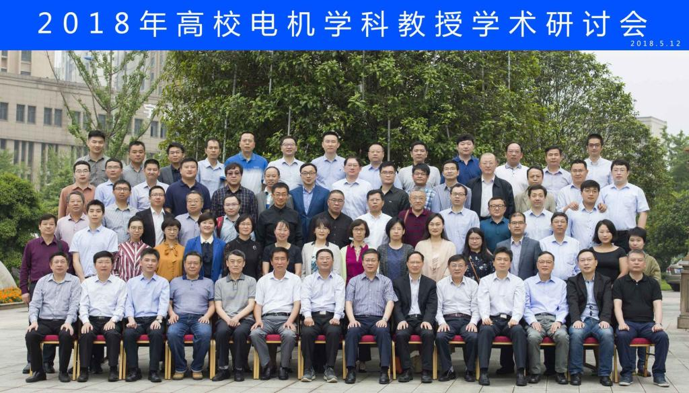

<!---->

The **ReLER** (Recognition, LEarning, Reasoning) Lab is affiliated with CAI, University of Technology Sydney. The lab is committed to enable machines to
accurately recognize the environment, adaptively understand the human interactions, and
autonomously analyze the behavior through reasoning. To this end, we work on learning algorithms, computer
vision, natural language, and their intersections. Concretely, we aim at
developing novel methods for object, action, and event recognition, localizing the
positions, segmenting the instances in images and videos, understanding documents and dialogues. Additionally, we also study model
acceleration algorithms to speed up the recognition process.

In the real-world scenarios, data
hungry methods can probably fail due to fewer labeled data. We study weakly supervised
learning, unsupervised learning, zero-shot learning, few-shot learning to adapt the model in
this circumstance. Besides recognition, it is also essential for the machines to understand
natural language instructions and queries, as well as communicate with humans fluently.
We develop captioning, question answering, dialog systems for better visual understanding
and reasoning. For more sophisticated human language comprehension, we target at
knowledge extraction, relation mapping, structural graph reasoning.

Our ReLER Lab actively
collaborates with the industry partners to build effective systems and make impacts in real-
world.

### **Lab News**

  
    
    

    

        <a href="{{ site.baseurl }}{{ post.url }}">- {{ post.title }}</a> (<small>{{post.date | date: "%m/%d/%y" }}</small>)
        

    

    
  

 

### Visiting Us
CAI,
Level 10, Building 11,
[81 Broadway, UTS](https://www.google.com/maps/place/UTS+Faculty+of+Engineering+and+IT/@-33.8840299,151.199234,15z/data=!4m5!3m4!1s0x0:0x5aa7383337c73213!8m2!3d-33.8840299!4d151.199234),
Ultimo, Sydney
